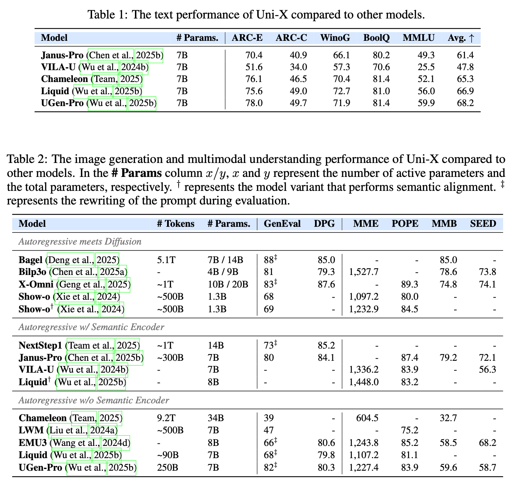

## 🎉 Model Checkpoints Available at Huggingface!

**Checkpoints**: https://huggingface.co/JitaiHao/Uni-7B



## 📂 Project Structure

```
.
├── configs/                # Training args, model configs, distributed configs (YAML), and conversation templates
├── data_process/           # Data preprocessing scripts, especially for VQGAN image encoding
├── draw_pics/              # Scripts to generate plots from analysis results
├── evaluation/             # Automated evaluation pipeline
│   ├── T2I_Eval/           # Text-to-Image evaluation module
│   ├── api_server.py       # API server for VQA evaluation
│   ├── eval_template.py    # Main entry point for evaluation tasks
│   └── eval_vqa.py         # VQA evaluation client
├── uni_arch/                 # Core training logic
│   ├── train/              # Trainer, data collator, and main training script
│   └── ...
├── modeling/               # Model architecture definitions (Uni-X, MoE, MoT, etc.)
├── tools/                  # Various utilities (gradient analysis, data translation, logging, etc.)
└── ...
```

## ⚙️ Setup and Installation

Install the required training dependencies:

```bash
conda create -n uni python=3.10 -y
conda activate uni

pip install torch==2.5.1 torchvision==0.20.1 torchaudio==2.5.1 --index-url https://download.pytorch.org/whl/cu121 --resume-retries 10
pip install torch==2.5.1 transformers[torch]==4.53.3 accelerate deepspeed==0.15.4 torchvision datasets==3.6.0
pip install transformers==4.53.3 fire matplotlib seaborn wandb loguru
MAX_JOBS=8 pip install flash-attn==2.7.4.post1 --no-build-isolation
```

For dpg eval:
```bash
conda create -n dpg --clone uni -y
conda activate dpg
pip install -r dpg_requirements.txt
```

For text eval:
```bash
conda create -n lm_eval --clone uni -y
conda activate lm_eval
pip install lm_eval==0.4.9
```

For vis understanding eval:
```bash
conda activate dpg
pip install uvicorn fastapi 
```

## Data Composition

**PT (Pre-Training)**:  
- Understanding: `minigemini`, `finevision`, `blip3o-pretrain`  
- Generation: Internal data, `journeydb`, `imagenet`, `cc12m`, `laion`  
- Text: `CCI3-HQ`, `DCLM`, `STARCODER`  

**SFT (Supervised Fine-Tuning)**:  
- Models: `minigemini`, `finevision`, `blip3o-60k`, `sharegpt4o`, `openorca`  
- Total dataset size: 240B tokens, including approximately 117B VQ (image) tokens  

---

## 📦 Data Preparation

The model requires image data to be preprocessed into VQ tokens. The VQGAN tokenizer we are utilizing is from the [Chameleon repository](https://github.com/facebookresearch/chameleon). Once downloaded, ensure the files are placed in the directory `data_process/vqgan` and named `vqgan.yaml` and `vqgan.ckpt`.

Images will be encoded into **32 x 32 = 1024 VQ tokens**.

### Steps for Data Preparation:

1. **Image Encoding**:  
   - Use scripts such as `data_process/encode_vq_finevision.py` or `data_process/convert_imagepair_cc512_batch_version.py` to transform image-text pair data into VQGAN encodings.  
   - These scripts will encode images into discrete token sequences and pair them with corresponding text annotations.

2. **Data Format**:  
   - Final training data should be stored in `jsonl` format.  
   - Each line in the file must include text, VQGAN codes, and other metadata.  
   - For specific details about the expected format, refer to the logic in `uni_arch/train/data_collator.py`.
## 🚀 Model Training

The training process is managed through a centralized shell script. You only need to configure the parameters at the top of the script.

Below is an example script for multi-node, multi-GPU (7 machines, 8 GPUs each) SFT using DeepSpeed:

```bash
#!/bin/bash
# The script will exit immediately upon encountering any errors
set -e
python -c 'import torch; a=torch.rand(2,device="cuda:0")'
# =================================================================
# 1. Parameter Configuration
# All experiment parameters are modified here for clarity
# =================================================================

# -- Task & Logging --
run_name='Qwen2.5'
output_dir="../ckpts/${run_name}"
extra_tags="7b_baseline,uni_v4"

# -- Preliminary Commands --
echo "--- Checking nvidia-smi ---"
nvidia-smi
echo "--- Pulling latest code from git ---"
git pull

# -- Distributed Training Config --
main_port=16799
main_ip='10.54.107.215'
hostfile='./host_file7'
config_file="configs/accel_ds_7machine.yaml"

# -- Model & Data Paths --
model_path="../models/Qwen2.5-7B-AddTokens"
data_path="../mock/datasets/uni_v4/"
streaming_data=1
data_percentage="1.0"
t2i_ratio=0.6
image_folder="./data/"
shuffle_seed=218
vq_resolution=512

# -- Model Architecture --
model_version="gemma"
custom_cls="auto"
model_spec_module="none"
vision_encode_layers=0
vision_decode_layers=0
all_modal_visible=0
unfreeze_keys="train-all"
ffn_vision_size=0
ffn_share_size=0

# -- Training Hyperparameters --
bf16="true" # Use "bf16", "fp16", or "no"
learning_rate=5e-5
max_steps=200000
train_batch_size=10
model_max_length=10240
use_data_packing=2 # 2 for sft
grad_accum_steps=1
weight_decay=0.0
warmup_ratio=0.05
lr_scheduler="constant_with_warmup"
ignore_instruction=1

# -- Saving & Evaluation --
save_steps=0.1 # Save at intervals, 0.1 means saving every 10%
save_total_limit=1
eval_strategy="no"
eval_batch_size=10
logging_steps=10

# -- Performance & Others --
gradient_checkpointing=1
dataloader_workers=16
resume_from_checkpoint=0

# =================================================================
# 2. Execute Command
# The following section typically doesn't need modification
# =================================================================

echo "--- Starting Training: ${run_name} ---"

nohup accelerate launch --main_process_port ${main_port} --main_process_ip "${main_ip}" --deepspeed_hostfile "${hostfile}" --config_file "${config_file}" liquid/train/hf_trainer.py --model_name_or_path "${model_path}" --data_path "${data_path}" --percentage "${data_percentage}" --shuffleseed ${shuffle_seed} --T2I_ratio ${t2i_ratio} --vq_resolution ${vq_resolution} --image_folder "${image_folder}" --bf16 ${bf16} --output_dir "${output_dir}" --run_name "${run_name}" --model_custom_cls "${custom_cls}" --model_spec_module "${model_spec_module}" --vision_encode_layers ${vision_encode_layers} --vision_decode_layers ${vision_decode_layers} --ffn_vision_size ${ffn_vision_size} --ffn_share_size ${ffn_share_size} --unfreeze_keys "${unfreeze_keys}" --use_data_packing ${use_data_packing} --all_modal_visible ${all_modal_visible} --extra_tags "${extra_tags}" --learning_rate ${learning_rate} --max_steps ${max_steps} --per_device_train_batch_size ${train_batch_size} --per_device_eval_batch_size ${eval_batch_size} --model_max_length ${model_max_length} --gradient_accumulation_steps ${grad_accum_steps} --eval_strategy "${eval_strategy}" --save_strategy "steps" --save_steps ${save_steps} --save_total_limit ${save_total_limit} --weight_decay ${weight_decay} --warmup_ratio ${warmup_ratio} --lr_scheduler_type "${lr_scheduler}" --logging_steps ${logging_steps} --gradient_checkpointing ${gradient_checkpointing} --dataloader_num_workers ${dataloader_workers} --report_to "wandb" --resume_from_checkpoint ${resume_from_checkpoint} --version "${model_version}" --streaming_data ${streaming_data} --accelerator_config '{"dispatch_batches": false}' --ignore_instruction ${ignore_instruction}  > train.log 2>&1 &

echo "--- Training launched in background. Check train.log for output. ---"
```

**How to Use:**

1.  Copy the template above into a new `train.sh` file.
2.  Modify the parameters in the **Parameter Configuration** section to fit your needs.
3.  Execute the script: `bash train.sh`.

## 📊 Model Evaluation

This framework provides a powerful, template-driven evaluation pipeline that can run multiple types of evaluations with a single command.

**1. Configure Experiments**

Define the list of evaluations you want to run in the `evaluation/exp.py` file. Each experiment is a dictionary specifying the model path and the evaluation types.

  * **`eval_type`**: A list that specifies the evaluation tasks. Possible values include:
      * `"text"`: Text capability evaluation (MMLU, ARC, etc.).
      * `"vis_und"`: Visual understanding evaluation (MME, POPE, MMBench, etc.).
      * `"dpg_bench"`: DPG-Bench text-to-image evaluation.
      * `"geneval"`: GenEval text-to-image evaluation.

**Example `evaluation/exp.py`:**

```python
EXPERIMENTS = [
    {
        "name": "sft_v4-ckpt5k",
        "model_path": "../mock/ckpts/.../checkpoint-5000",
        
        # --- Text-to-Image Eval Config ---
        "dpg_bench_prompts_path": "evaluation/T2I_Eval/dpg_bench/dpg_prompts_zh_fixed.jsonl",
        "geneval_prompts_path": "evaluation/T2I_Eval/geneval/geneval_prompts_zh.txt",
        "cfg": 2.0,

        # --- Visual Understanding Eval Config ---
        "vis_und_server_gpus": 8,
        "vis_und_max_batch_size": 40,
        "vis_und_api_nproc": 1600,
        "vis_und_max_tokens": 10,
        
        # --- Specify Evaluation Tasks to Run ---
        # You can combine multiple tasks or run just one.
        "eval_type": ["geneval", "dpg_bench", "vis_und", "text"],
    },
]
```

**2. Run Evaluation**

After configuring `exp.py`, run the following command from the project root to start the automated evaluation:

```bash
# Set PYTHONPATH to ensure project modules can be found
export PYTHONPATH=. 

# Launch the evaluation
python evaluation/eval_template.py
```

The script will automatically parse the configuration in `exp.py` and execute each experiment in sequence:

  * For **Text-to-Image** tasks, it will first generate all images in parallel and then invoke the corresponding evaluation scripts to compute scores.
  * For **Visual Understanding** tasks, it will automatically start a multi-GPU API server in the background, run the VQA client for evaluation, and shut down the server upon completion.
  * For **Text** tasks, it will invoke `lm-eval-harness` for evaluation.

All logs and results will be saved in the `outputs/` directory.

## 💡 Inference

  * **API Service**: You can run `evaluation/api_server.py` independently to deploy a persistent, OpenAI-compatible API endpoint for easy integration with other applications.
  * **Script-based Inference**: The file `evaluation/uni_infer.py` contains the core text and image generation logic (the `any_modal_chat_api` function) and can be used as a reference for writing custom inference scripts.

## 📄 License

This project is licensed under the MIT License. See the `LICENSE` file for details.

## Acknowledgement

This project's partial code is based on https://github.com/FoundationVision/Liquid.

## Citation
```text
@article{hao2025unixmitigatingmodalityconflict,
      title={Uni-X: Mitigating Modality Conflict with a Two-End-Separated Architecture for Unified Multimodal Models}, 
      author={Jitai Hao and Hao Liu and Xinyan Xiao and Qiang Huang and Jun Yu},
      year={2025},
      eprint={2509.24365},
      archivePrefix={arXiv},
      primaryClass={cs.CV},
      journal={arXiv preprint},
      url={https://arxiv.org/abs/2509.24365}, 
}

@article{tang2025ugenunifiedautoregressivemultimodal,
      title={UGen: Unified Autoregressive Multimodal Model with Progressive Vocabulary Learning}, 
      author={Hongxuan Tang and Hao Liu and Xinyan Xiao},
      year={2025},
      eprint={2503.21193},
      archivePrefix={arXiv},
      primaryClass={cs.CL},
      journal={arXiv preprint},
      url={https://arxiv.org/abs/2503.21193}, 
}
```